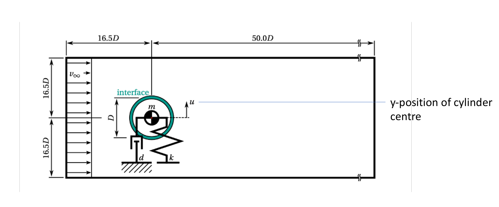

## Setup

We simulate a 2D flow around a cylinder. The cylinder is not fixated, but mounted on a spring-damper system which allows it to move in the y-direction. The vortex shedding of the flow brings the cylinder to oscillate. This setup has received attention as a test case for numerical simulations [1] in the past and is backed up with experimental data [2]. 

The up-and-down oscillation can be counteracted by moving the root point of the spring [3]. To adjust the root point accordingly, a PID controller is implemented. The full setup is shown below:



## Multi coupling

We want to use three participants for the simulation: `Fluid`, `Solid` and `Controller`. For this we need to use a multi-coupling scheme. Read more about the concept [here](https://precice.org/configuration-coupling-multi.html)

We are using a composition of bi-coupling schemes with one implicit coupling between `Fluid` and `Solid` and one explicit coupling between `Solid` and `Controller`. The participants `Fluid` and `Controller` are not coupled, as they don't exchange any data with each other.

The configuration of this case looks like this:

```xml
<coupling-scheme:serial-implicit> 
  <participants first="Fluid" second="Solid" /> 
  ...
</coupling-scheme:serial-implicit> 

<coupling-scheme:serial-explicit> 
  <participants first="Solid" second="Controller" /> 
  ...
</coupling-scheme:serial-explicit>

```

## About the solvers

OpenFOAM is used for the `Fluid` participant. The spring-damper system is solved in a separate Python `solid` participant. Finally, the PID algorithm is calculated in a FMU as participant `Controller`.

- *OpenFOAM*: Calculates the flow
- *FMI*: A FMU model run by [runner.py](../../runner). The parameters of the model can be changed in the setting files.
- *Python*: A python script solving the spring damper system.

## Running the simulation

**Please check the settings first. With the current settings, this case can take up to 45h on a normal laptop.**

Open three seperate terminals. The commands for the `Solid` and the `Controller` are:

```bash
cd solid-python
./run.sh
```

and

```bash
cd controller-fmi
./run.sh
```

For the `Fluid` participant, it's a good idea to run the case with `pimpleFoam` instead of the `run.sh` script to see the terminal output. You have the option to run OpenFOAM either serial or parallel. The serial simulation can be started by running

```bash
cd fluid-openfoam
pimpleFoam
```
while for the parallel computaion you need to use

```bash
cd fluid-openfoam
decomposePar
mpirun -np 2 pimpleFoam -parallel
```

**These instructions need updating, they just refer to the use on a Laptop with 2 physical and 2 virtual cores (4 total).**

## Post-processing

Options for post-processing
- Plot the watchpoint (plot script pending)
- Plot the outputs of the controller with `plot-timeseries.py`
- Animate the OpenFOAM results by running `paraFoam`. When OpenFOAM is run in parallel, pre-processing of the outputs is necessary (eg by running `decomposePar`).

## References

[1] Placzek, A. and Sigrist, J.F. and Hamdouni, A. [Numerical Simulation of an oscillating cylinder in a cross-flow at low Reynolds number: Forced and free oscillations](https://dx.doi.org/10.1016/j.compfluid.2008.01.007), Computers and Fluids, 2009, 38 (1), pp.80-100

[2] Anagnostopoulus, P. and Bearman, P.W. Response Characteristics of a vortex-excited cylinder at low Reynolds numbers, Journal of Fluids and Structures, January 1992, DOI: 10.1016/0889-9746(92)90054-7

[3] Sicklinger, S. [Stabilized Co-Simulation of Coupled Problems including Fields and Signals](https://www.researchgate.net/publication/269705153_Stabilized_Co-Simulation_of_Coupled_Problems_Including_Fields_and_Signals), Technical University of Munich, Dissertation

## Contributions

Many thanks to David Schneider for his help with OpenFOAM
