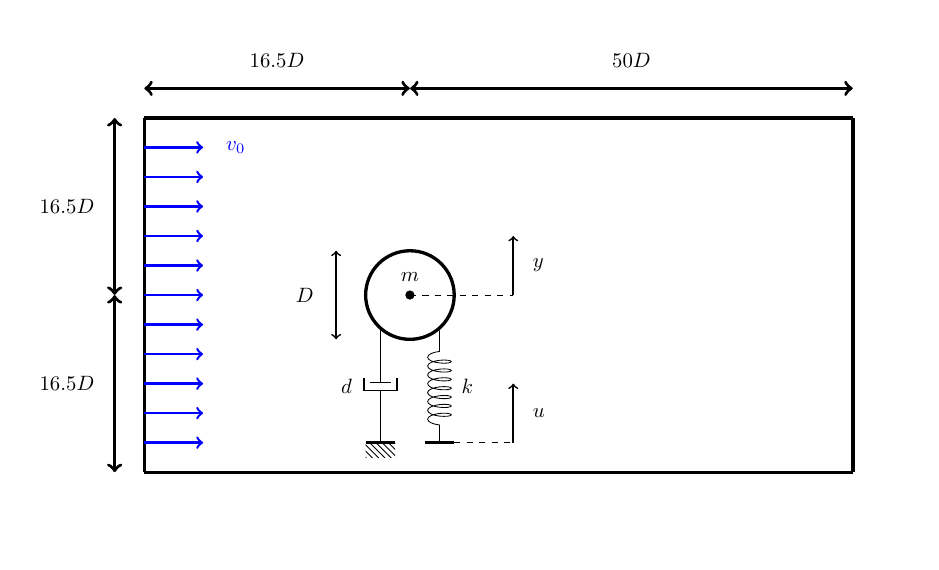

## Setup

We simulate a 2D flow around a cylinder. The cylinder is not fixed, but mounted on a spring-damper system which allows it to move in the y-direction. The vortex shedding of the flow brings the cylinder to oscillate. This setup has received attention as a test case for numerical simulations [1] in the past and is backed up with experimental data [2]. 

The up-and-down oscillation can be counteracted by moving the root point of the spring [3]. To adjust the root point accordingly, a PID controller is implemented. The full setup is shown below:

## Current status

### Running OpenFOAM as standalone

In this setup, the cylinder is fixed. The simulation results for drag and lift coefficients match the cited literature. 
Conclusion: The OpenFOAM calculation and setup are correct.

### Running OpenFOAM coupled to the solid participant (bicoupling)

#### Fixed cylinder

A bidirectional explicit coupling between Fluid and Solid. The cylinder is fixed by defining a constant displacement value in the solid participant. Again, the drag and lift coefficients match the cited literature. However, there is a difference between the drag and lift forces **exported directly from OpenFOAM** and the forces **exported from the solid participant**. The difference is very small for the drag force, but more concerning for lift force. Still, both force values are in the range of the cited literature.
Conclusion: 
- The force values from OpenFOAM are not transferred to Solid identically
- The transfer error is not very big and should not lead to the displacement error of 2 magnitudes reported in the thesis

#### Moving cylinder

A bidirectional implicit coupling between Fluid and Solid. The cylinder moves according to the calculation in Solid.

The drag coefficient matches the cited literature, but the difference between force values from OpenFOAm and Solid remains:

The lift coefficient matches the cited literature, but the difference between force values from OpenFOAm and Solid remains:

The displacement of the cylinder looks very different than reported in the thesis. There, the oscillation already reached a stable state at T=3s with a maximum of y_max = 6*e⁻6. Now the displacement develops slower, but continues to grow:

The simulation was stopped due to the long runtime on a normal laptop.

Conclusion:
- The bicoupling should be repeated for a longer simulation time to get the steady state value of the displacement
- The threeway coupling seems to be introduce some change for the displacement, maybe the coupling to the FMI Runner is not correct

## References

[1] Placzek, A. and Sigrist, J.F. and Hamdouni, A. [Numerical Simulation of an oscillating cylinder in a cross-flow at low Reynolds number: Forced and free oscillations](https://dx.doi.org/10.1016/j.compfluid.2008.01.007), Computers and Fluids, 2009, 38 (1), pp.80-100

[2] Anagnostopoulus, P. and Bearman, P.W. Response Characteristics of a vortex-excited cylinder at low Reynolds numbers, Journal of Fluids and Structures, January 1992, DOI: 10.1016/0889-9746(92)90054-7

[3] Sicklinger, S. [Stabilized Co-Simulation of Coupled Problems including Fields and Signals](https://www.researchgate.net/publication/269705153_Stabilized_Co-Simulation_of_Coupled_Problems_Including_Fields_and_Signals), Technical University of Munich, Dissertation
