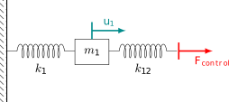
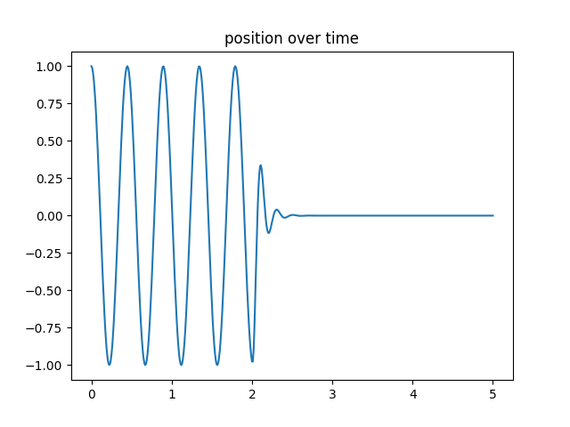
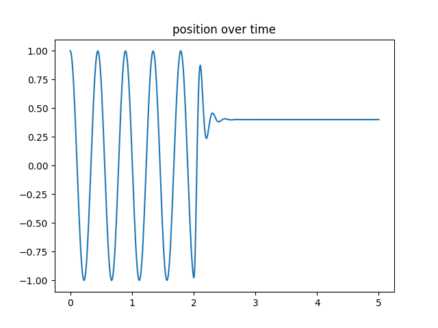
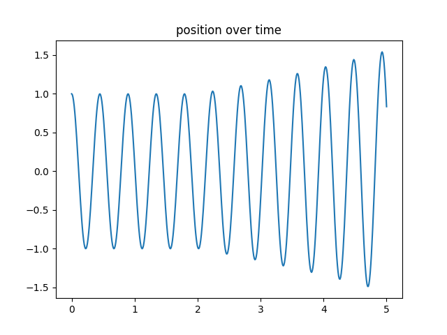
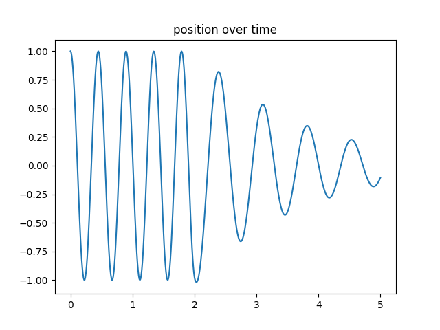
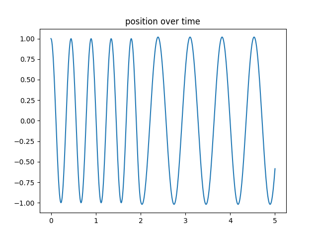


This is an adaption of the [original oscillator tutorial](https://github.com/precice/tutorials/tree/master/oscillator). Read how to get the case files in the [tutorials introduction](https://www.precice.org/tutorials.html).


## Setup

This tutorial solves a simple mass-spring oscillator with one mass and two springs. The system is coupled to a PID controller, which controls the force acting on the loose spring:



The controller allows to choose a setpoint `r` for the position of the mass. Also, you can set input signals to allow changing inputs over the simulation time.

## Available solvers

This tutorial is only available in Python. You need to have preCICE and the Python bindings installed on your system.

- *Python*: An example solver using the preCICE [Python bindings](https://www.precice.org/installation-bindings-python.html). This solver also depends on the Python libraries `numpy`, which you can get from your system package manager or with `pip3 install --user <package>`.
- *FMI*: An example solver using FMU models for computation. This solver depends on the Python libraries `numpy` and `FMPy` which you can install with conda or pip, for example `pip3 install --user fmpy`. You also need the compiled FMU model `PIDcontroller.fmu`. The model for Linux is part of this repository in the folder [FMUs](../../FMUs). For other systems, please recompile the model from the provided [C-files](../../FMUs/cmake). If you want to change the model parameters, for example the control gains `k_p`, `k_i`, `k_d`, or choose a different setpoint `r`, have a look inside the setting files in [pid](fmi/pid).

## Running the Simulation

Open two separate terminals and start both participants by calling:

```bash
cd python
./run.sh
```

and

```bash
cd fmi
./run.sh
```

## Post-processing

Each simulation run creates two files. The file of the oscillator, called `trajectory-Mass.csv`, contains the position and velocity of the mass over time. The file of the controller, called `controller-output.csv`, contains the control output and the error used in the control algorithm. You can use the script `plot-trajectory.py` for post-processing. Type `python3 plot-trajectory --help` to see available options. You can, for example, plot the position of the mass by running

```bash
python3 plot-trajectory.py python/output/trajectory-Mass.csv U_OVER_T
```

The solvers allow you to study the effect of different control gains. The controller is activated at `t=2`.

With a setpoint of `r=0.0` and the gains `k_p=800`, `k_i=25` and `k_d=20`, the system reaches stability:



Let's check if these gains also work for a setpoint of `r=0.5`. The results show stability with an offset, indicating that the gains have not been chosen optimally:



However, with the gains `k_p=0`, `k_i=10` and `k_d=-0.3` the system clearly diverges:




For details about the original setup and the integration scheme, refer to [1].

## Open problems

In some scenarios, the current setup has very different results for explicit and implicit coupling. For example, take the case with `k_p=-120.0`, `k_i=0` and `k_d=0`. The setpoint is set to `r=0`.

Results of the explicit coupling look promising:



Results of the implicit coupling look very different:



The problem is clearly related to the checkpointing of the PID, especially the kp gain. It vanishes when not using checkpoints for the PID in implicit coupling.

## References

[1] V. Schüller, B. Rodenberg, B. Uekermann and H. Bungartz, A Simple Test Case for Convergence Order in Time and Energy Conservation of Black-Box Coupling Schemes, in: WCCM-APCOM2022. [URL](https://www.scipedia.com/public/Rodenberg_2022a)

